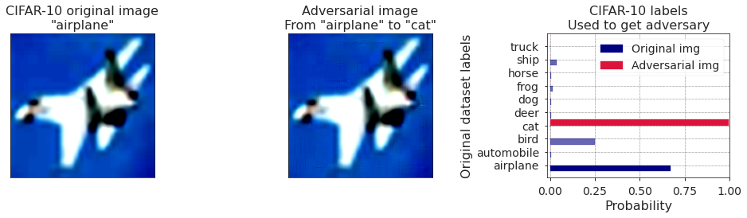

# Adversarial Examples for Kernel Methods

MIT UROP Proposal for IAP 2021
January 14, 2021

**Student Name**: Yang Yan
**Faculty/Direct Supervisor**: Alexander (Sasha) Rakhlin
**Off-Campus Location**: Sandy, UT, USA

## Project Overview

Neural networks have been at the focus of image recognition research since AlexNet made its debut in the 2012 ImageNet image recognition competition, achieving a record $85\%$ accuracy on the classification dataset, more than $10\%$ more than any classical methods submitted. In all subsequent years, submissions to the competition have been dominated by neural networks.

However, unlike some classical methods, neural networks are known to be adversarially susceptible: by modifying an image slightly in a way which would not cause confusion to a human, many neural networks can be manipulated to classify incorrectly. Take, for example, the state-of-the-art CLIP (Contrastive Language-Image Pretraining) network released by OpenAI less than two weeks ago.

***Figure 1.** On the left, an image of an airplane from the CIFAR-10 dataset, slightly perturbed to become the adversarial image in the middle, such that CLIP recognizes the adversarial image as a cat instead. Credit: [Stanislav Fort](https://stanislavfort.github.io/2021/01/12/OpenAI_CLIP_adversarial_examples.html).*

Adversarial attacks are modeled by their bounds: the perturbed image in Figure 1 is constrained by the perturbation intensity from the original of each pixel, an example of an L-infinity bound. Perturbations can also be modeled in terms of L-2 bounds, rotations, shifts, slants, etc.—notably, by definition, humans are robust to all such attack models.

There has been substantial research devoted to explaining and improving adversarial robustness. Neural networks are unlikely to exhibit robust behavior within a specific attack model without undergoing *adversarial training* specialized to that model. However, improving adversarial robustness remains an open question, as no amount of adversarial training produces models which perform even close to humans.

We propose to approach this question by first studying adversarial examples on kernel-based classification techniques, a precursor to neural network classification. Because neural networks of varying architectures are mathematically difficult objects to analyze, we hope to utilize the more approachable kernels to explain adversarial robustness from the mathematical properties of the kernel function and dataset. Finally, we hope to carry these insights back into neural networks by leveraging Neural Tangent Kernel (NTK) theory, which approximates the behavior of infinite-width neural networks with a kernel function.

### Team

Prof. Sasha Rakhlin and I will be working with Prof. Gregory Wornell, Dr. Yuheng Bu, and M. Eng. student Tony Wang of the SIA lab together on this project. Tony and I will head this project, with him also hoping to incorporate much of it into his M. Eng. thesis.

## Personal Responsibilities & Goals

Tony and I will meet regularly to set updated goals based on suggestions from Prof. Rakhlin, Prof. Wornell, and Dr. Bu. Part of my time will be devoted to building the mathematical maturity to better approach NTK theory and kernel classification. In the remaining weeks of IAP, I hope to complete the following individual goals, and be able to discuss them with the team to establish further questions.

1. Compare adversarial accuracy for classical kernels (specifically Laplace) with that of the NTK on the full MNIST dataset.
   
   This will require solving the memory limitation problem which arises from the $O(N^2)$ memory, likely via approximation methods for the kernel Gram matrix.
   
	 Our current results show that the Laplace kernel greatly outperforms the NTK on a training set of $256$ MNIST examples at $28\%$ adversarial accuracy vs. $10\%$ under the L-infinity attack model with a perturbation bound of 2/100 intensity levels per pixel. We define adversarial accuracy to be the number of samples in the test set for which there does not exist an adversarial example within the given attack model.
2. Synthesize a simplified dataset for which there exist adversarial examples for kernel methods. We define simplicity to be the dimensionality of the dataset.
   
	 By deriving adversarial examples for low-dimensionality data, it will be much easier to visualize the shape and properties of our kernel function classifier and how the adversarial examples arise.

	 We suspect that there is a possibility that low-dimensional data (as opposed to high-dimensional images) are adversarially robust for most classification methods.
3. Begin approaching Tony’s formulation of the *effective margin* by calculating it empirically for some classifiers on MNIST.
   
	 For a binary classifier $f:X\to[0,1]$ and a datapoint $x\in X$, we define the effective margin as

	 $$\text{emarg}(x)=\frac{|g(x)|}{||\nabla g(x)||_*}$$

	 where $*$ denotes the dual norm of the norm in the space $X$.

	 We are working on bounding the deviation of the effective margin from the true margin of $x$ on classifier $f$. We define the true margin as

	 $$f(x+\text{marg}(x))=0.$$

	 We suspect the effective margin to have an approachable form for kernels under the L-2 norm on $X$, and hope to use it as a proxy to evaluate true margin and thus adversarial accuracy.

## Remote Work Plan

Tony and I will be meeting regularly every few days. Prof. Rakhlin and I will meet every two or three weeks (likely once near the end of IAP), while Tony and I will meet with Prof. Wornell, Dr. Bu every week. At each meeting, we will discuss any results we’ve derived, and bounce ideas for what to explore next.

We will primarily be using Google Colab for any computational experiments, and our own personal machines to surpass any potential compute limitations from Colab. We have not run into any problems with this setup until now, and any more composed solution requires a substantial amount of additional computation support we don’t believe is warranted at this time.

## Personal Statement

Through this UROP, I hope primarily to gain experience working in theoretical adversarial robustness, build the mathematical maturity to better conduct research in this area in the future, as well as establish personal relationships with Tony, Prof. Rakhlin, and Prof. Wornell, potentially in hopes of conducting an M. Eng. under their guidance next year.

